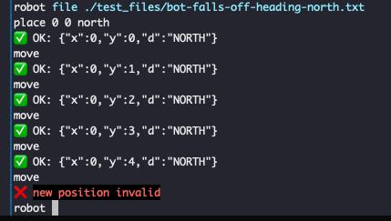
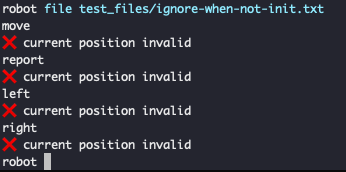
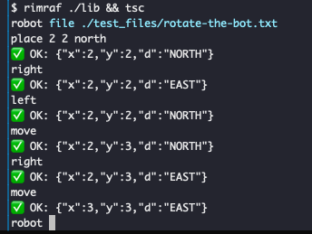

# Robot
🤖 A virtual robot game on table top
<!-- toc -->
- [Overview](#overview)
- [System Requirements](#system-requirements)
- [How To Play](#how-to-play)
- [Snapshots](#snapshots)
- [Implementation Details](#implementation-details)
- [Unit Test](#unit-test)
<!-- tocstop -->

## Overview
- This is a game of virtual robot on a table top of fixed size.
- `place <x coordinate> <y coordinate> <direction: east | west | north | south>` command places bot on any coordinate facing any direction.
- `move` command moves the bot by once cell in current direction.
- `report` tells the current position of the bot
- `left`, `right` rotates the bot by 90 degrees
- The game always prevents the bot from falling off
- If the bot is not placed in a vlid position all commands are ignored with an error
- `file <filename>` commands lets you run a file containing each command in a line (__Empty lines are not tolerated in the file__)

## System Requirements
- node
- yarn/ npm
- emoji support in terminal

## How To Play
```
 yarn install
 yarn run start
 # robot prompt appears
 help
 place 0 1 north
 move
 right
 left
 report
 exit
```

## Snapshots
- bot is prevented from falling off
  
   
- ignore any command when bot has not been intialized
  
   
- normal navigation
  
   

## Implementation Details
- [Vorpal](https://vorpal.js.org/) is used for cli farmework
- Jest is used for test
- Configure table size in `.env` file
- There is validation on inputs
- Running multiple file command in same session does not include a reset in between
- There are some test files in `test_files`
- The `file` command was introduced because vorpal does not have any inbuilt way to pipe commands from bash

## Unit Test
```
yarn run test
```
